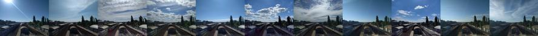

========================================================
**rWeather** - Погода в Раменском
========================================================
Simple meteorological weather site from my weatherstation

Сайт проекта <https://rweather.ru>

***Поучавставовать в сборе данных о погоде можно, заполнив [google form](https://forms.gle/qqb2nZxQvaY3juC86)***
***
Текущая погода в г.Раменское Московской области
-------------------------------------------------------
  1. На сайте отображается текущая метеоинформация с домашней метеостанции
  
  2. Отображаются графики для некоторых погодных показателей:
  
    2.1 Температура
    
    2.2 Влажность
    
    2.3 Давление
    
    2.4 Освещенность
    
    2.5 Скорость ветра
    
    2.6 Точка росы
    
    2.7 Радиационный фон
    
    2.8 Эффективная температура
    
   Графики доступны в интервалах (сутки, месяц, год)
   
  3. На пиктограмме погоды отображается краткосрочный прогноз (3 часа),
  
вычисляемый по тренду давления (алгоритм взят из [appnotes NXP company](https://www.nxp.com/docs/en/application-note/AN3914.pdf))

-------------------------------------------------------------
***Подробнее о том как устроена метеостанция читать [здесь](https://docs.google.com/document/d/1Ac72J99dzBsslXN9RBYGBGheJdEMsxDL9WAPOpaAZ20/edit?usp=sharing)***

***Больше в google альбоме [фото](https://photos.app.goo.gl/RowJdUpUZFsMvuWU8)***
